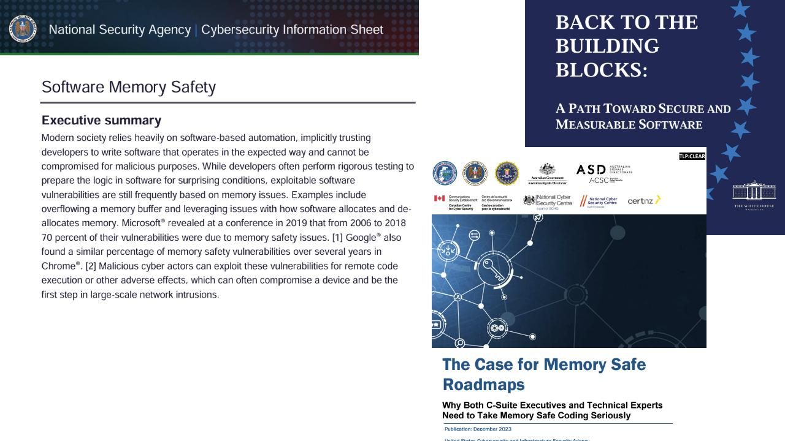
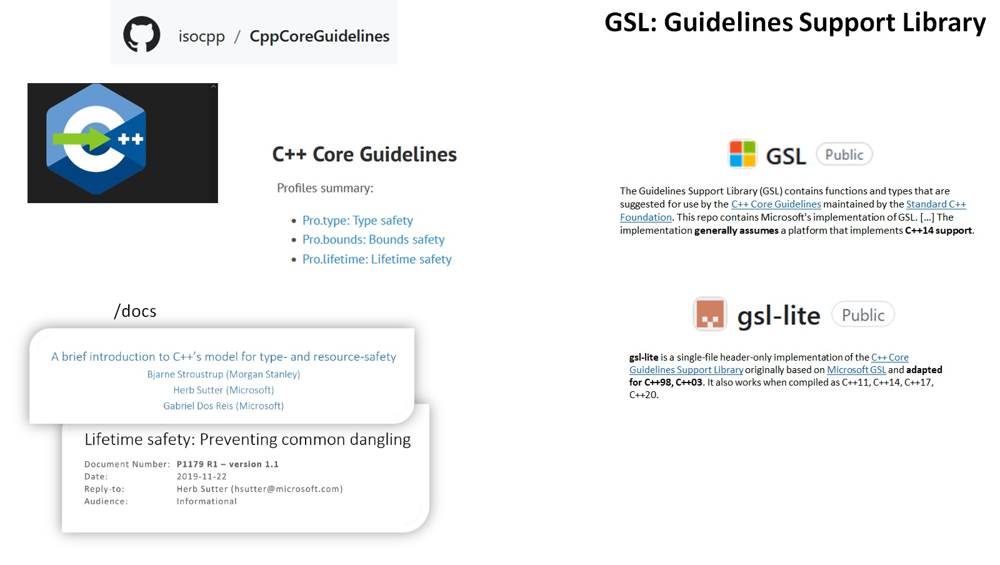

= Safe C++
:revealjsdir: https://cdnjs.cloudflare.com/ajax/libs/reveal.js/3.9.2
:revealjs_theme: white
:revealjs_slideNumber: true
:revealjs_history: true
// :revealjs_showNotes: true
:icons: font
:source-highlighter: highlightjs

// [.reveal]
// [.columns]

// SHOW don't TELL, pictures of what is being said
// https://www.researchgate.net/publication/228516602_Eliminating_Buffer_Overflows_Using_the_Compiler_or_a_Standalone_Tool

== Topics

* Memory Safety is hot
* {cpp} has a bad rep
* All is not lost, there are solutions
* Core guidlines and GSL

== Memory Safety is Hot

// * The White House Office of the National Cyber Director (ONCD) link:https://www.whitehouse.gov/oncd/briefing-room/2024/02/26/press-release-technical-report/[press release] offering new guidance document that provides recommendations for securing cyber infrastructure. 
// *  The National Security Agency (NSA) has link:https://www.nsa.gov/Press-Room/News-Highlights/Article/Article/3215760/nsa-releases-guidance-on-how-to-protect-against-software-memory-safety-issues/[released] a new guidance document that provides recommendations for securing {cpp} code.
// // * A NIST link:https://www.nsa.gov/Press-Room/News-Highlights/Article/Article/3215760/nsa-releases-guidance-on-how-to-protect-against-software-memory-safety-issues/[press release] published guidance today to help software developers and operators prevent and mitigate software memory safety issues, which account for a large portion of exploitable vulnerabilities.
// * link:https://www.cisa.gov/case-memory-safe-roadmaps[CISA, NSA, FBI press release] pushing for meory safe roadmaps from organizations. 
// * and more...
// * Most of us have heard the "70% of all vulnerabilities are memory safety issues" statistic

== {cpp} has a bad rep
// "memory unsafe programming languages, such as C and C++, are among the most common programming languages"

NSA Press Release: "NSA advises [...] a strategic shift from programming languages [...], such as C/C++ and assembly, to a memory safe language when possible"

"[...] languages that both lack traits associated with memory safety and also have high proliferation across critical systems, such as C and C++"

== Why is C++ unsafe?

=== unsafe casting

[source, c++]
----
// Casting
uint32_t long_data = 0xDEADBEEF;
uint16_t truncated = (uint16_t) long_data;
// Lost information
----

=== Unions are crazy
[source, c++]
----
// Silly example, but we do this with bits 
union Data
{
  int i;
  float f;
}

Data data;
data.f =  42.0;

// Yeah not int data
int value = f;
----

=== Ownership/lifetimes what?
[source, c++]
----
// lack of ownership/lifetime checking, 
int32_t* anInt = new int32_t(42);
delete anInt;
int32_t badRead = *anInt;
----

=== Raw arrays because speed
[source, c++]
----
// Raw arrays/pointers
char buffer[SIZE];

for(int i = 0; i=SIZE; i++){
  read(buffer[i]);  // WRONG: read(buffer[SIZE])
}
----

== How to make C++ Safe

There are solutions which comes down to:

* Avoid unsafe language features
* Use safe library alternatives
* Enforcement via static analysis tools

// == The current landscape of safe C++

// * Bjarne Stroustrup, the creator of {cpp}, and Herb Sutter, the chair of the ISO C++ standards committee have been discussing how {cpp} can be used safely.
// * Their papers discussing solutions on the topic date back to 2015

// [%notitle]
=== Core Materials

=== Foundational Docs of Safe C++

* Bjarne and Herb lay the groundwork in their white papers and talks
* See their _very_ detailed documents @ link:https://github.com/isocpp/CppCoreGuidelines/tree/master/docs[github.com/isocpp/CppCoreGuidelines/docs]
** link:https://github.com/isocpp/CppCoreGuidelines/blob/master/docs/Introduction%20to%20type%20and%20resource%20safety.pdf[A brief introduction to {cpp}'s model for type and resource safety]
** link:https://github.com/isocpp/CppCoreGuidelines/blob/master/docs/Lifetime.pdf[Lifetime Safety: Preventing ommon dangling]
// ** link:https://github.com/isocpp/CppCoreGuidelines/blob/master/docs/P0122R4.pdf[span: bounds-safe views for sequences of objets]
// ** link:https://github.com/isocpp/CppCoreGuidelines/blob/master/docs/ctor-dtor-raii-popl12.pdf[A Mehanized Semanticsc for {cpp} Objet Construction and Destruction, with Appliations to Resourcce Management]
// ** link:https://github.com/isocpp/CppCoreGuidelines/blob/master/docs/gsl-intro.md[Using the Guidelines Support Library (GSL): A Tutorial and FAQ]
* They also have many talks available on youtube

== Adopting Safe C++

What's adoption look like?

* Use smart pointers over raw pointers (ownership built-in)
* Use span over raw arrays
* Use variants over unions
* Avoid type conversion, and use C++ style casts when necessary

=== Easy way

clang-tidy provides cppcoreguidelines-* checks to enforce these rules

image::images/CppStandards.jpg[]

== Safe C++ Static Analysis

* clang-tidy provides cppcoreguidelines-* checks to enforce these rules
* MISRA C++ 2023 also incorporates these rules and static analysis tools like LDRA and Polyspace can will enforce these rules once they support the new standard

[.columns]
== Column Text Alignment

[.column.has-text-left]
--
Something Short

Something So Long That We Need It Aligned
--

[.column.has-text-justified]
Lorem ipsum dolor sit amet, consectetur adipiscing elit, sed do eiusmod tempor incididunt ut labore et dolore magna aliqua.

[.column.has-text-right]
--
Something Short

Something So Long That We Need It Aligned
--

[%auto-animate]
== !

[source%linenums,js,data-id=planets]
----
let planets = [
  { name: 'mars', diameter: 6779 },
]
----

[%auto-animate]
== !

[source%linenums,js,data-id=planets]
----
let planets = [
  { name: 'mars', diameter: 6779 },
  { name: 'earth', diameter: 12742 },
  { name: 'jupiter', diameter: 139820 }
]
----

[%auto-animate]
== !

[source%linenums,js,data-id=planets]
----
let circumferenceReducer = ( c, planet ) => {
  return c + planet.diameter * Math.PI;
}

let planets = [
  { name: 'mars', diameter: 6779 },
  { name: 'earth', diameter: 12742 },
  { name: 'jupiter', diameter: 139820 }
]

let c = planets.reduce( circumferenceReducer, 0 )
----